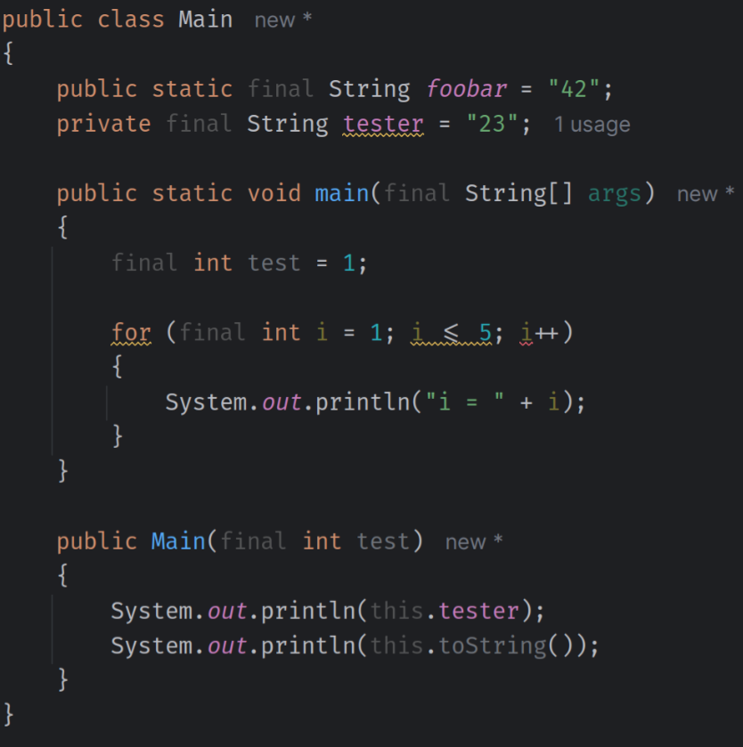

# Info
This IntelliJ plugin was vibecoded (casually created for fun) solely for testing purposes.
It changes the `final` and `this` keywords in a less dominant color to make them less prominent.

# Build for IntelliJ Sandbox Mode

1. Make sure you have the [Plugin DevKit](https://plugins.jetbrains.com/plugin/22851-plugin-devkit) installed.
2. Clone this repository.
3. Open the project with IntelliJ IDEA.
4. Run the `runIde` Gradle task:  
   `Gradle -> keywords -> Tasks -> intellij platform -> runIde`

A new Sandbox IDE window will open with the plugin installed.

# Build for Use in Your Main IDE

1. Run `./gradlew buildPlugin`
2. You will find a ZIP file at  
   `build/distributions/keywords-1.0-SNAPSHOT.zip`  
   which you can install in your IDE.